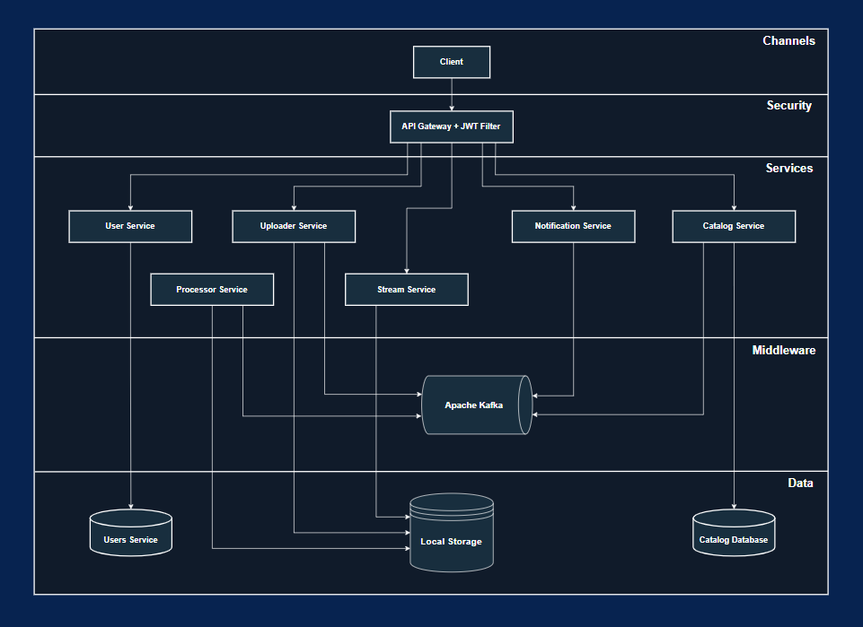

# 🎥 VideoSphere - Fullstack Microservices Video Platform

A production-grade, microservices-based architecture that simulates a modern, high-volume video streaming and processing platform — similar to YouTube.
Through this project, I demonstrate my end-to-end software engineering expertise, covering the design and development of distributed system architectures, asynchronous communication, multimedia processing, and full-stack application development.

---

## Description

VideoSphere is a distributed, production-grade video streaming platform that I designed and developed entirely from scratch.  
It allows users to upload, process, and consume video content across multiple resolutions while maintaining scalability, resilience, and asynchronous processing through an event-driven architecture.  

The system follows an **API-First design** approach — each microservice exposes its own **OpenAPI specification**, all documented under the `contracts/openapi/` directory.

---

## Technical Highlights

This project showcases a complete end-to-end implementation of a cloud-ready distributed video platform.

### Backend (Spring Boot)
- Built with **Spring Boot microservices**, leveraging:
  - **Spring WebFlux** for reactive, non-blocking Microservices.
  - **Spring Data JPA** with **PostgreSQL** for persistence.
  - **Spring Kafka** and **Reactor Kafka** for asynchronous event-driven communication.
  - **JWT-based authentication** for secure access.
- Each microservice runs independently, communicating through **Apache Kafka topics**.
- The **Processor Service** uses **FFmpeg** to transcode uploaded videos into multiple resolutions (`1080p`, `720p`, `360p`) and extract video duration.
- The **Stream Service** supports adaptive streaming via **HLS (HTTP Live Streaming)**, efficiently handling `.m3u8` and `.ts` files.
- The **Catalog Service** provides video metadata and leverages **PostgreSQL Full-Text Search** for efficient query matching and related video recommendations.
- The **Notification Service** pushes real-time WebSocket notifications to users (e.g., when video processing completes).
- The **API Gateway** centralizes external API exposure and routes requests to internal services with clear separation of concerns.

### Frontend (Angular)
- Developed with **Angular**, focusing on component reusability and separation of concerns between UI logic and services.
- Integrated **JWT interceptor** that automatically injects the authentication token into each HTTP request.
- Fully responsive design — optimized for both desktop and mobile.
- Implemented reusable components like the global **Navbar**, shared across routes and dynamically rendered depending on authentication state.
- The **video player** supports multiple resolutions using **HLS.js**, allowing seamless switching between qualities.
- Real-time **notifications** displayed in the UI upon backend-triggered events.

### DevOps & Deployment
- Entirely **Dockerized** — each microservice, along with PostgreSQL, Kafka, and Zookeeper, runs in isolated containers.
- The whole system can be brought up with a single command:
  ```bash
  docker compose up --build
---

### Key Features

- **Register**

  

- **Login**

  

- **Home page with paginated videos**

  

- **Videos search**

  

- **Video player with quality selection and recommended videos**

  

- **Video upload**

  

- **View your profile**

  

- **View another user's profile**

  

---

## Architecture



The platform consists of multiple decoupled microservices communicating asynchronously through Kafka, orchestrated via an API Gateway that handles routing, security, and aggregation.

---

## System Interaction Flows

### User Registration Flow (Synchronous Flow)


### User Login Flow (Synchronous Flow)


### Upload Initiation (Synchronous Flow)


### Video Processing (Asynchronous Flow)


### Content Loading & Search (Synchronous Flow)


### Related videos load (Synchronous Flow)


### User profile load (Synchronous Flow)


### User's videos load (Synchronous Flow)


### Another user's profile load (Synchronous Flow)


### Another user's videos load (Synchronous Flow)


---

## Tech Stack

- Backend:
    - Java 17
    - Spring Boot
    - Spring Cloud Gateway
    - Spring WebFlux
    - Spring Data JPA
    - Spring Kafka
    - Reactor Kafka
    - Apache Kafka & Zookeeper
    - PostgreSQL
    - FFmpeg
    - Docker + Docker Compose

- Frontend:
    - Angular 20
    - TypeScript, HTML, CSS

- Architecture & Communication:
    - Microservices
    - Event-driven messaging
    - API Gateway pattern
    - RESTful APIs (OpenAPI)

---

## Notes & Future Improvements 

Due to environment constraints, the current implementation uses local file storage for video uploads and processing.

However, the architecture is fully designed to support cloud-based storage (e.g., AWS S3, Google Cloud Storage, or Azure Blob).

Adapting it would require a few changes in the Uploader Service, Processor Service and Stream Service to handle file uploads and streaming URLs.

---

## How to Run

1. Clone this repository:

```bash
git clone https://github.com/CRT-Dev21/fullstack-microservices-video-platform.git
```
2. Navigate into the project directory:

```bash
cd fullstack-microservices-video-platform
```
3. Start all services:

```bash
docker compose up --build
```
4. Access the platform at:

```bash
http://localhost:4200
```