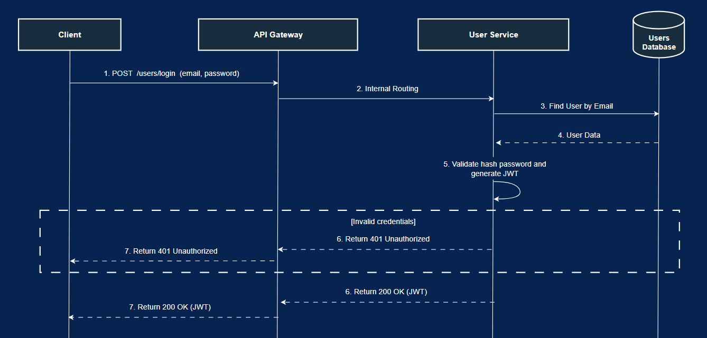

# 🎥 VideoSphere - Fullstack Microservices Video Platform

A production-grade, microservices-based architecture that simulates a modern, high-volume video streaming and processing platform — similar to YouTube.
Through this project, I demonstrate my end-to-end software engineering expertise, covering the design and development of distributed system architectures, asynchronous communication, multimedia processing, and full-stack application development.

---

## Description

VideoSphere is a distributed, production-grade video streaming platform that I designed and developed entirely from scratch.  
It allows users to upload, process, and consume video content across multiple resolutions while maintaining scalability, resilience, and asynchronous processing through an event-driven architecture. 

The system follows an **API-First design** approach. Each microservice's contract is defined by its dedicated **OpenAPI specification**, all documented on `contracts/openapi/`.

---

## Technical Highlights

This project showcases a complete end-to-end implementation of a cloud-ready distributed video platform.

### Backend (Spring Boot)
- Built with **Spring Boot microservices**, leveraging:
  - **Spring WebFlux** for reactive, non-blocking Microservices.
  - **Spring Data JPA** with **PostgreSQL** for persistence.
  - **Spring Kafka** and **Reactor Kafka** for asynchronous event-driven communication.
  - **JWT-based authentication** for secure access.
- Each microservice runs independently, communicating through **Apache Kafka topics**.
- The **Processor Service** uses **FFmpeg** to transcode uploaded videos into multiple resolutions (`1080p`, `720p`, `360p`) and then **segment them into HLS format** (`.m3u8` playlists and `.ts` segments) for adaptive delivery. It also extracts video duration.
- The **Stream Service** implements and delivers **Adaptive Streaming** based on the **HLS** manifests (`.m3u8` files) generated by the Processor Service, ensuring efficient content delivery to diverse clients.
- The **Catalog Service** provides video metadata and leverages **PostgreSQL Full-Text Search** for efficient query matching and related video recommendations.
- The **Notification Service** pushes real-time **WebSocket** notifications to users (e.g., when video processing completes).
- The **API Gateway** centralizes external API exposure and routes requests to internal services with clear separation of concerns.

### Frontend (Angular)
- Developed with **Angular**, focusing on component reusability and separation of concerns between UI logic and services.
- Integrated **JWT interceptor** that automatically injects the authentication token into each HTTP request.
- Fully responsive design — optimized for both desktop and mobile.
- Implemented reusable components like the global **Navbar**, shared across routes and dynamically rendered depending on authentication state.
- The **video player** supports multiple resolutions using **HLS.js**, allowing seamless switching between qualities.
- Real-time **notifications** displayed in the UI upon backend-triggered events.

### DevOps & Deployment
- Entirely containerized with **Docker** — each microservice, along with PostgreSQL, Kafka, and Zookeeper, runs in isolated containers.
- The whole system can be brought up with a single command:
  ```bash
  docker compose up --build
---

### Key Features

- **Register**

  

- **Login**

  

- **Home page with paginated videos**

  

- **Videos search**

  

- **Video player with quality selection and recommended videos**

  

- **Video upload**

  

- **View your profile**

  

- **View another user's profile**

  

---

## Architecture


This diagram illustrates the architecture, structured in five layers designed to ensure clear separation of concerns, scalability, and maintainability.

### 1. Channels (Consumption Channels)
This top layer represents all external clients (web, mobile, or third-party applications) that initiate interactions with the system. It serves as the primary access interface for consuming the platform's services.

### 2. Security (API Gateway & Security)
This layer acts as the unified entry point for the entire system. The API Gateway manages request routing and applies security policies, such as authentication via the JWT Filter before forwarding requests to the appropriate service.

### 3. Services
This core layer holds the application's business logic, distributed across multiple independent microservices.

### 4. Middleware
This layer manages all asynchronous communication across the architecture. Apache Kafka allows services to be decoupled and completely independent.

### 5. Data
This is the persistence layer, which holds the storage systems. It consists of structured databases (Users and Catalog) and file storage (Local or **Cloud Storage**).

---

## Sequence Diagrams

### User Registration


### User Login



### Video Upload


### Video Processing (Asynchronous)


### Video Search &  Content Display


### Related Videos Recommendation


### User Profile Display


### User’s Videos Display


---

## Tech Stack

- Architecture & Design Patterns:
    - Microservices
    - Event-driven messaging
    - API Gateway pattern
    - RESTful APIs (OpenAPI)

- Frontend:
    - Angular 20
    - TypeScript, HTML, CSS

- Backend:
    - Java 17
    - Spring Boot
    - Spring Cloud Gateway
    - Spring WebFlux
    - Spring Data JPA
    - Spring Kafka
    - Reactor Kafka
    - FFmpeg
    - Docker + Docker Compose

- Data & Messaging:
    - PostgreSQL
    - Apache Kafka & Zookeeper
    - Local file storage

---

## Notes & Future Improvements 

Due to environment constraints, this implementation stores and processes video files locally.
However, the system was architected with adaptability in mind, making it compatible to integrate cloud storage providers in the future such as **AWS S3**, **Google Cloud Storage**, or **Azure Blob**.

Adapting it would require a few changes in the `Uploader Service`, `Processor Service` and `Stream Service` to handle file uploads, fetch files for processing, and streaming URLs.

---

## How to Run

1. Clone this repository:

```bash
git clone https://github.com/CRT-Dev21/fullstack-microservices-video-platform.git
```
2. Navigate into the project directory:

```bash
cd fullstack-microservices-video-platform
```
3. Start all services:

```bash
docker compose up --build
```
4. Access the platform at:

```bash
http://localhost:4200
```